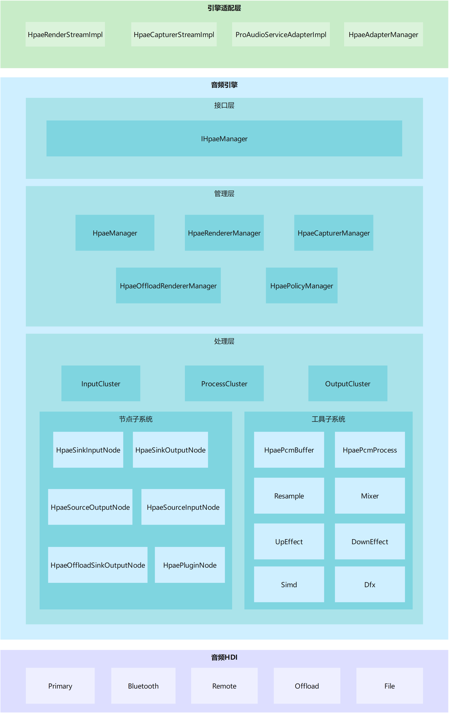
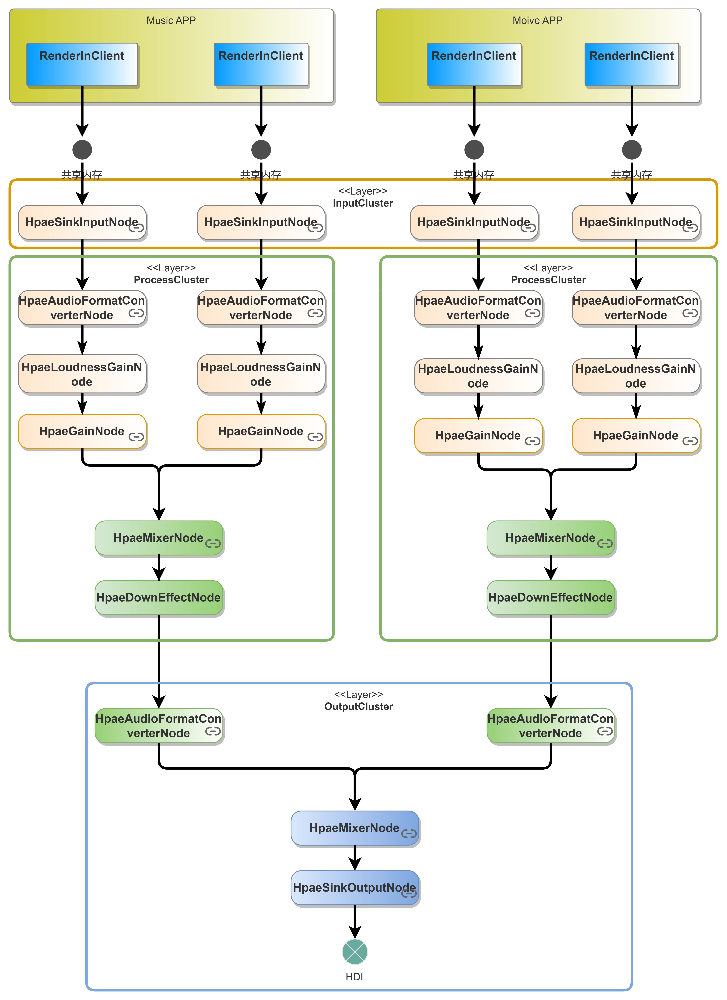
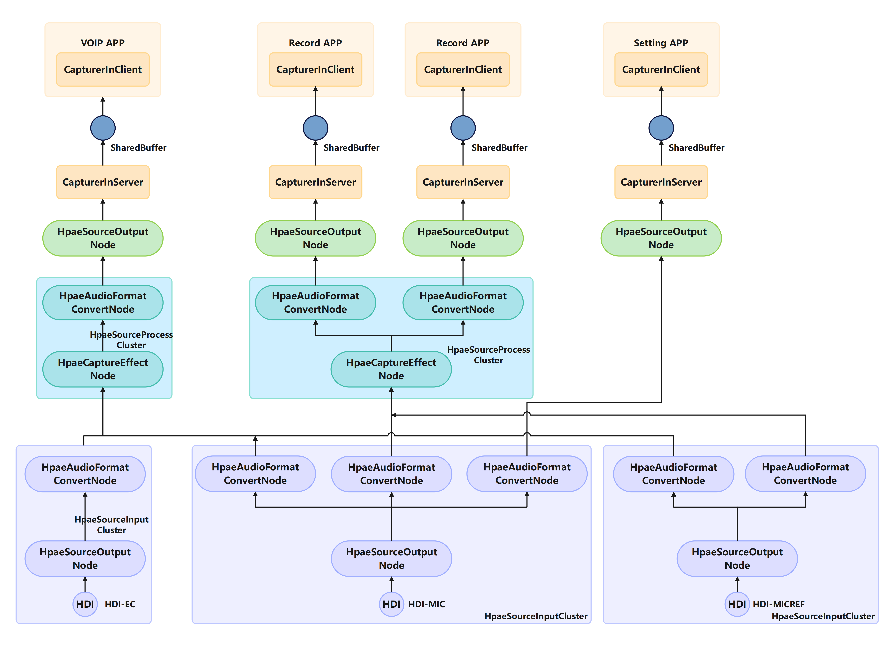

# 引擎组件

## 简介
引擎部件作为音频组件的一部分，用于实现处理播放以及录制相关音频数据的混音、重采样、格式转换、音效以及跨设备音频流转等功能

**图1** 引擎架构图



### 架构理念
架构特点是以节点的形化处理音频数据，每个节点负责相对独立的功能模块，节点之间可以组合链接，实现预期的对音频数据的处理。
相比于原来的pulseaudio引擎，具有以下优势
* 线程模型简化，线程管理更简单
* 控制流与数据流分离，减少音频数据卡顿
* 无锁架构，从设计上避免稳定性问题
* 面向对象的实现更利于开发者开发，扩展性更好

## 目录
部件目录结构如下
```
├─buffer                               # 缓存代码
├─dfx                                  # 维测代码
├─manager                              # 管理代码  
│  ├─include
│  └─src
├─node                                 # 节点代码
│  ├─include
│  └─src
├─plugin                               # 算法插件
│  ├─channel_converter
│  │  ├─include
│  │  └─src
│  └─resample
│      ├─include
│      └─proresampler
├─simd                                 # 指令优化
├─test                                 # 单元测试
│  └─unittest
│      ├─common
│      ├─dfx
│      ├─manager
│      ├─node
│      ├─plugin
│      │  ├─channel_converter
│      │  └─proresampler
│      ├─resource
│      └─utils
└─utils                                # 工具代码
```

## 使用说明
### 通路创建  

ProAudio通路暂时收编Primary（primary、a2dp、remote、dp、multi channel、usb等）通路、低功耗offload通路、Remote分流通路、内录通路以及普通录制通路。
1. **OpenAudioPort通路打开**
通过使用**HpaeManager**实例的**OpenAudioPort**接口打开通路，绑定对应南向设备，引擎本身不会自启通路。起流时策略通过调用ProAudio接口打开通路，也就是一个CapturerManager、或者RendererManager、或者InnerCapturerManager分别对应上、下行和内录通路。
    ```
        AudioModuleInfo moduleInfo;                                                 // 通路规格参数信息
        moduleInfo.lib = "libmodule-hdi-source.z.so";                               // 示例，通路类型为普通录制
        int32_t portId = IHpaeManager::GetHpaeManager().OpenAudioPort(moduleInfo);  // 返回内部分配portId，用于关闭通路
    ```
2. **CloseAudioPort通路关闭**  
    ```
        int32_t portId；                                                            // 通路id
        IHpaeManager::GetHpaeManager().CloseAudioPort(moduleInfo);
    ```

### 普通播放
以下步骤提供了在普通播放场景下如何使用引擎能力播放音频流的方法
1. 使用**HpaeManager**实例的**CreateStream**接口，根据音频流信息创建播放流实例
    ```
    HpaeStreamInfo streamInfo;                          // 音频流信息
    streamInfo.streamType = STREAM_MUSIC;               // 示例，流类型为音乐
    auto &hpaeManager = IHpaeManager::GetHpaeManager();
    int32_t ret = hpaeManager.CreateStream(streamInfo);
    ```
2. **HpaeManager**实例的注册状态回调以及写数据回调接口
    ```
    int32_t ret;
    ret = hpaeManager.RegisterStatusCallback(HPAE_STREAM_CLASS_TYPE_PLAY, streamInfo.sessionId, shared_from_this());  // 注册状态回调
    ret = hpaeManager.RegisterWriteCallback(streamInfo.sessionId, shared_from_this());                                // 注册写数据回调
    ```
3. 使用**HpaeManager**实例的**Start**接口，根据音频流id启动对应音频流的播放
    ```
    uint32_t sessionId = 123456;                                                                // 音频流Id示例
    int32_t ret = IHpaeManager::GetHpaeManager().Start(HPAE_STREAM_CLASS_TYPE_PLAY, sessionId);
    ```
4. 使用**HpaeManager**实例的**Stop**接口，停止音频流的播放
    ```
    int32_t ret = IHpaeManager::GetHpaeManager().Stop(HPAE_STREAM_CLASS_TYPE_PLAY, sessionId);
    ```

5. (可选) **Drain**接口，将缓存数据播放完毕，一般调用**Stop**前调用

6. (可选) **Flush**接口，清理缓存数据，一般用于seek场景

7.  播放结束后，使用**HpaeManager**实例的**DestroyStream**接口，释放对应音频流以及资源
    ```
    int32_t ret = IHpaeManager::GetHpaeManager().DestroyStream(HPAE_STREAM_CLASS_TYPE_PLAY, sessionId);
    ```

### 普通录制
以下步骤提供了在普通播放场景下如何使用引擎能力播放音频流的方法
1. 使用**HpaeManager**实例的**CreateStream**接口，根据音频流信息创建播放流实例
    ```
    HpaeStreamInfo streamInfo;                          // 音频流信息
    streamInfo.streamType = STREAM_RECORDING;           // 示例，流类型为录音
    auto &hpaeManager = IHpaeManager::GetHpaeManager();
    int32_t ret = hpaeManager.CreateStream(streamInfo);
    ```

2. **HpaeManager**实例的注册状态回调以及写数据回调接口
    ```
    int32_t ret;
    std::weak_ptr<ICapturerStreamCallback> callback = std::make_shared<HpaeCapturerStreamImpl>();                     // 录制流适配层
    ret = hpaeManager.RegisterStatusCallback(HPAE_STREAM_CLASS_TYPE_PLAY, streamInfo.sessionId, shared_from_this());  // 注册状态回调
    ret = hpaeManager.RegisterReadCallback(streamInfo.sessionId, callback);                                           // 注册读数据回调, callback为流适配层，对接capturer_in_server
    ```

3. 使用**HpaeManager**实例的**Start**接口，根据音频流id启动对应音频流的播放
    ```
    uint32_t sessionId = 123456;                                                                   // 音频流Id示例
    int32_t ret = IHpaeManager::GetHpaeManager().Start(HPAE_STREAM_CLASS_TYPE_RECORD, sessionId);
    ```

4. 使用**HpaeManager**实例的**Pause**接口，暂停音频流的播放
    ```
    int32_t ret = IHpaeManager::GetHpaeManager().Pause(HPAE_STREAM_CLASS_TYPE_RECORD, sessionId);
    ```

5. 使用**HpaeManager**实例的**Stop**接口，停止音频流的播放
    ```
    int32_t ret = IHpaeManager::GetHpaeManager().Stop(HPAE_STREAM_CLASS_TYPE_RECORD, sessionId);
    ```

6.  播放结束后，使用**HpaeManager**实例的**DestroyStream**接口，释放对应音频流以及资源
    ```
    int32_t ret = IHpaeManager::GetHpaeManager().DestroyStream(HPAE_STREAM_CLASS_TYPE_RECORD, sessionId);
    ```


**提供上述基本音频播放使用范例。更多接口请参考[**i_hpae_manager.h**](https://gitee.com/openharmony/multimedia_audio_framework/blob/master/services/audio_engine/manager/include/i_hpae_manager.h)**

## 规格说明

### 管理类规格
1. **HpaeManager**

    负责所有连接管理，只有一个实例，包含多个播放管理、多个录制管理、策略管理等，绑定HpaeManagerThread

2. **HpaeRendererManager**

    播放管理，可以有多个实例（与通路一一对应），负责播放节点管理，绑定下行HpaeSignalProcessThread线程

3. **HpaeCapturerManager**

    录制管理，可以有多个实例（与通路一一对应），负责录制节点管理，绑定上行HpaeSignalProcessThread线程

4. **HpaeOffloadRendererManager**
    
    负责offload播放管理

5. **HpaePolicyManager**

    负责全局控制类的参数以及指令下发，由HpaeManager管理调用
    

### 处理层聚类规格
1. **InputCluster**

    包含HpaeSinkInputNode等输入节点
2. **ProcessCluster**

    与音效绑定，包含负责处理数据的相关节点
3. **OutputCluster**
    
    与通路绑定，包含与南向HDI对接的节点

### 节点规格
1. **HpaeSinkInputNode**

    播放通路作为引擎数据流入的第一个节点（数据入口），主要负责读取客户端的音频数据（回调方式），以及将数据位深转化为32位浮点的功能，本身不对数据做任何处理。一条音频流对应一个SinkInputNode，**生命周期跟随音频流的生命周期**。

2. **HpaeAudioFormatConverterNode**

    负责采样率、位深以及声道数转化

    ProcessCluster中的ConverterNode与音频流一一对应，**在调用start时创建，在调用pause或者stop时被销毁**
    
    OutputCluster中的ConverterNode与ProcessCluster一一对应，**生命周期跟随ProcessCluster**

3. **HpaeLoudnessGainNode**

    负责调节响度增益，普通通路下不对数据做任何处理，一条音频流对应一个LoudnessGainNode，**在调用start时创建，在调用pause或者stop时被销毁**

4. **HpaeGainNode**

    负责音量处理以及淡入淡出，一条音频流对应一个GainNode，**在调用start时创建，在调用pause或者stop时被销毁**

5. **HpaeMixerNode**

    负责混音处理，绑定ProcessCluster或者OutputCluster


6. **HpaeRenderEffectNode**

    负责播放通路音效处理，绑定ProcessCluster

7. **HpaeSinkOutputNode**

    负责播放通路与南向HDI对接，一条通路对应一个SinkOutputNode，**生命周期跟随OutputCluster**

8. **HpaeSourceInputNode**

    负责录制通路与南向HDI对接，录制通路中引擎的数据入口，一条通路至少对应一个SourceInputNode（主麦克风），存在异构EC和MicRef等辅助麦的情况下，可能存在存在3个SourceInputNode，分别对应不同主麦和EC、MicRef两个辅助麦，**生命周期跟随SourceInputCluster**

9. **HpaeCaptureEffectNode**
    
    负责录制通路音效处理，绑定HpaeSourceProcessCluster

10. **HpaeSourceOutputNode**
    
    作为录制通路中一条录制流的出口，对接一个capturer_in_server，通过capturer_in_server回调往共享内存写数据，**生命周期伴随流的生命周期**

11. **HpaePluginNode**

    处理插件节点，属于抽象父类节点，包含上下行音效、重采样、混音、音量以及淡入淡出节点

### 工具规格

1. **HpaePcmBuffer**

    引擎的缓存分配和使用，支持多声道

2. **HpaePcmProcess**

    单通道数据基本处理

3. **Resample**

    重采样算法

4. **Mixer**

    混音算法

5. **UpEffect**
    
    上行录制音效处理

6. **DownEffect**

    下行播放音效处理

7. **Simd**

    指令集优化

8. **Dfx**

    包含hook等维测能力


## 数据流转以及节点连接

**图2** 下行播放数据流转以及节点连接图



**图3** 上行录制数据流转以及节点连接图



其中，节点的连接时机是在调用**start**函数时，节点的断连时机是在调用**pause**或者**stop**  

数据拉取均通过OutputNode，即SinkOutputNode和SourceOutputNode，因此，下行通路数据流动只需要拉动SinkOutputNode，便可递归式从所有节点拉取数据（dfs）;  
而上行需要遍历所有SourceOutPutNode，对每一个节点都执行拉数据操作（同样为递归式），但ProAudio节点具有分发功能，因此，只有第一个节点可以触发上一个节点拉数据，其余节点均取到第一个节点所拉到的数据，并不会造成重复拉数据。